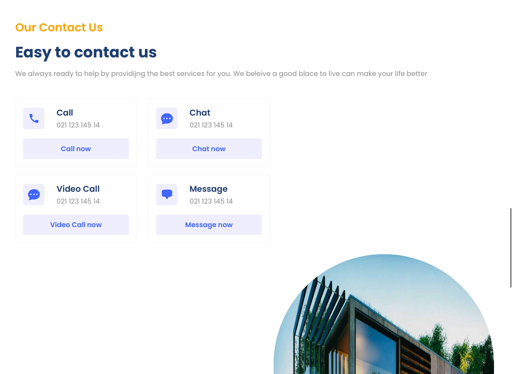

# Homyz

Homyz - a stunning Real Estate website using React, framer motion and vite

## Technologies Used

- Framer motion
- React.js
- vite

## Screenshots

## Getting Started

To run the project locally, follow these steps:

1. Clone the repository: `git clone <repository_url>`
2. Navigate to the project directory: `cd Homyz`
3. Install dependencies: `npm install`
4. Start the development server: `npm run dev`